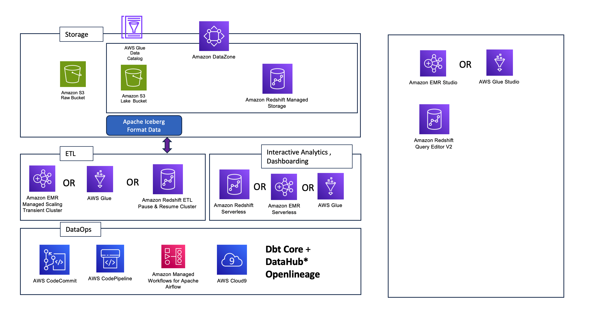
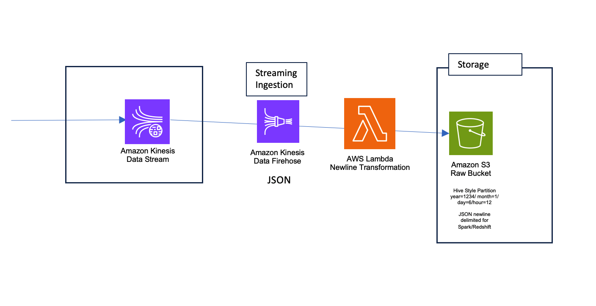
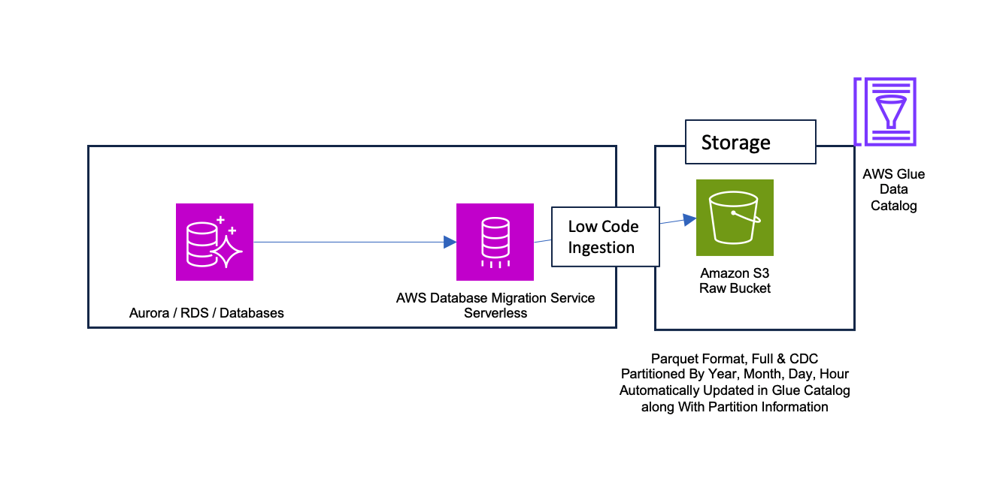
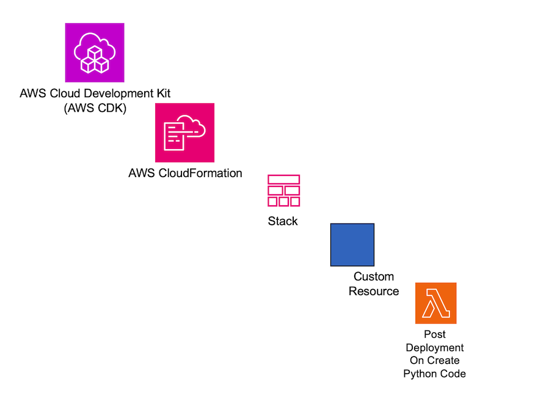
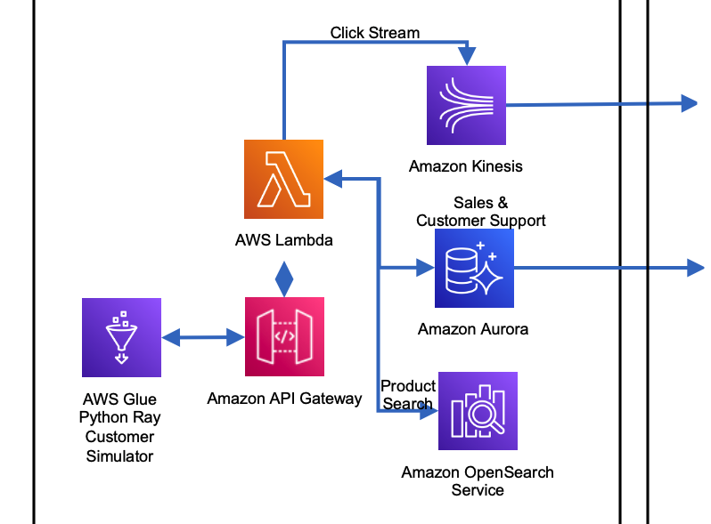
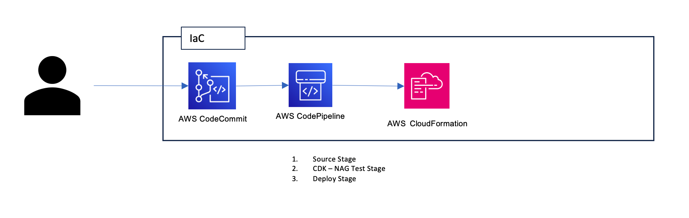

# Datalake Warehouse Accelerator

Before you deploy this sample datalake & data warehouse accelerator, you should get your security team to provide you permission boundary template to apply to this project. 

Refer to blog [Secure CDK deployments with IAM permission boundaries](https://aws.amazon.com/blogs/devops/secure-cdk-deployments-with-iam-permission-boundaries/) to find out more about securing CDK projects using permission boundaries.  

You can find a sample developer-policy in [*permission-boundary-sample*](project/permission-boundary-sample/) folder. You can use this for testing but rely on your security team to get right permission boundaries for development and production environments. 

E.g. if you are running this command from root folder of this repository, you could run the following command to use the sample permission boundary.   

```sh 
aws cloudformation create-stack --stack-name DeveloperPolicy \
        --template-body file://permission-boundary-sample/developer-policy.yaml \ 
        --capabilities CAPABILITY_NAMED_IAM
```

Additionally you should then use this policy to bootstrap CDK in the account. You could start by bootstrapping wihout the permission boundary for testing purpose and then apply the permission boundary later. You would have to destroy the stacks and redeploy them after applying permission boundaries in development environment. For production only deploy after applying permission boundary.  


E.g. This command would bootstrap CDK in the account with permission boundary applied. 

```sh
cdk bootstrap --custom-permissions-boundary developer-policy

```

To bootstrap additional environments into which AWS CDK applications will be deployed by the pipeline, use the following commands instead. The --trust option indicates which other account should have permissions to deploy AWS CDK applications into this environment. For this option, specify the pipeline's AWS account ID.

Again, you can omit the --profile option if your default AWS profile contains the necessary authentication configuration and AWS Region.

```sh

npx cdk bootstrap aws://ACCOUNT-NUMBER/REGION --profile ADMIN-PROFILE \
    --custom-permissions-boundary production-policy \
    --trust PIPELINE-ACCOUNT-NUMBER

```

# Security DevOps

This solution includes cdk-nag based automation for AWS CDK application to provide continual feedback and help align your applications with best practices.

cdk-nag includes several rule sets (NagPacks) to validate your application against. As of this post, cdk-nag includes the 
1. AWS Solutions, 
2. HIPAA Security, 
3. NIST 800-53 rev 4, 
4. NIST 800-53 rev 5, and 
5. PCI DSS 3.2.1 NagPacks. 

You can pick and choose different NagPacks and apply as many as you wish to a given scope. 

You could also write your own rules to add into your continuous integration. This way the security teams get higher quality code to review. 

cdk-nag rules can either be warnings or errors. Both warnings and errors will be displayed in the console and compliance reports. Only unsuppressed errors will prevent applications from deploying with the cdk deploy command. 

You can suppress specific warnings with documented evidence / reason to suppress that. The supressions are documented in compliance report csv file and output of the synth/deployment process.

You can see which rules are implemented in each of the NagPacks in the Rules Documentation in the GitHub repository.

Examples of automatically detected issues for "AWS Solutions" rules pack. These can then be fixed in CDK based cloud application. You could also apply PCI DSS or HIPPA rules as needed or create your own based on one of these.   
1. AwsSolutions-RS1: The Redshift cluster does not require TLS/SSL encryption. Enabling the "require_ssl" parameter secures data-in-transit by encrypting the connection between the clients and the Redshift clusters.
1. AwsSolutions-IAM5: The IAM entity contains wildcard permissions and does not have a cdk-nag rule suppression with evidence for those permission. Metadata explaining the evidence (e.g. via supporting links) for wildcard permissions allows for transparency to operators. This is a granular rule that returns individual findings that can be suppressed with 'appliesTo'. The findings are in the format 'Action::<action>' for policy actions and 'Resource::<resource>' for resources. Example: appliesTo:['Action::s3:*']
1. AwsSolutions-EC26: The resource creates one or more EBS volumes that have encryption disabled. With EBS encryption, you aren't required to build, maintain, and secure your own key management infrastructure. EBS encryption uses KMS keys when creating encrypted volumes and snapshots. This helps protect data at rest.

# Developing your data lake and data warehouse accelerator 

The accelerator can be built using python + CDK 

The accelerator comes with following reusable constructs that simplify the implementation by providing higher level of abstraction, while allowing flexibility to change details of implementation easily. 

With just few lines of python code, you can compose your datalake and data warehouse proejcts.

1. **DatalakeWarehouseProject** - Setup a data lake project. You can setup multiple projects 
1. **StreamingIngestion** - Setup one streaming ingestion pipeline for json data
1. **DMSIngestion** - Setup one DMS serverless ingestion pipeline 
1. **PostDeployCode** - Execute a lambda code on completion of deployment of a cdk stack
1. **RetailSimulatorApplication** - Setup a simulator application to generate online retail streaming and  
1. **RetailCDPSampleUseCases** - Setup sample analytics and AI use cases for retail simulator 
1. **CdkProvisioningStack** - Setup a cloud project with CI/CD DevSecOps

### 1. DatalakeWarehouseProject

```python
retail =  DatalakeWarehouseProject(app,
                                   "retail-lake",
                                   vpc=vpc_stack.vpc,
                                   project_id="retail",
                                   hasEmr=True, 
                                   hasRedshift=True,
                                   hasOpenlineage=True, 
                                   reuseOpenlineage=core_lake.openlineage,
                                   reuseSharedAirflowStack=core_lake.airflow_env, 
                                   s3_log_bucket=vpc_stack.s3_accesslog,
                                   s3_log_bucket_prefix="retail-lake")
```

This sets up a datalake warehouse project with some optional components and reusable components. 


| High Level Construct |  Parameters | Description | AWS Services Used | Some Open Source / Partner Tools |
|---|---|---|---|---|
|DatalakeWarehouseProject| **vpc**<br>:ec2.Vpc,<br> **project_id**<br>:str,<br> **hasEmr**<br>:bool,<br> **hasRedshift**<br>:bool,<br> **reuseSharedAirflowStack**:<br>AirflowEnvironmentStack=<br> None,<br>   **hasOpenlineage**<br>:bool=<br> False,<br> **reuseOpenlineage**<br>:DataHub=<br> None ,<br> **airflow_version**<br>:str=<br> "2.6.3",<br> **airflow_env_class**<br>:str=<br> "mw1.small",<br>  **airflow_max_workers**=<br> 1,<br> **airflow_access_mode**=<br> "PRIVATE_ONLY",<br> **emr_transient_master_type**<br>:str=<br> 'm6gd.xlarge',<br> **emr_transient_core_type**<br>:str=<br> 'm6gd.xlarge',<br> **emr_transient_worker_type**<br>:str=<br> 'm6gd.xlarge',<br> **emr_transient_core_size**<br>:int=<br> 2,<br> **emr_transient_worker_min_size**<br>:int=<br> 1,<br> **emr_transient_worker_max_size**<br>:int=<br> 10,<br> **redshift_etl_node_type**<br>:redshift.NodeType=<br> redshift.NodeType.RA3_XLPLUS,<br> **redshift_etl_node_count**<br>:int=<br> 1, <br>**redshift_concurrency_limit**=<br> 5,<br> **redshift_serverless_rpu_limit**=<br> 128,<br> **s3_log_bucket**<br>:s3.Bucket,<br> **s3_log_bucket_prefix**<br>:str |  Creates a data lake and/or warehouse project with related assets. E.g. It would create <br><br> 1. **Buckets** Create raw & datalake buckets <br><br> 2. **MWAA** Setup or reuse existing MWAA  <br><br> 3. **Redshift Clusters** - Setup a combination of pause and resume provisioned Redshift ETL cluster and a serverless workgroup for interactive analytics <br><br> 4. **EMR Clusters** Setup a combination of serverless EMR cluster for interactive analytics and transient managed scaling provisioned cluster which uses spot instances for worker nodes <br><br>5.**EMR Studio** with EMR Serverless Cluster  <br><br>6. **Dbt ETL Automation**Creates an ETL Automation using CodeCommit, CodePipeline <br><br>7. **Data Lineage** Setup Data Lineage using Dbt Core and/or [DataHub](https://datahubproject.io/docs/lineage/airflow/#automatic-lineage-extraction) for column level lineage (or provide reusable openlineage endpoint info) | S3,<br> VPC,<br> EMR + EMR-S,<br> Redshift + Redshift-S,<br> MWAA,<br> Codebuild,<br> CodePipeline| Dbt Core,<br> DataHub*,<br> Astronomer Cosmos|


### 2. StreamingIngestion 
```python 
streaming_ingestion = StreamingIngestion(app,
                                         "streaming-ingestion",
                                         streaming_ingestion_id="c360-clickstream",
                                         kinesis_stream_arn=customer_app.simulator_data_stream_stack.click_stream.stream_arn,
                                         destination_bucket=retail.raw_bucket,
                                         destination_key="clickstream"
                                         )
```


### 3. DMSIngestion
```python 
dms_vpc_role = DMSVpcRoleStack(app,"dms-vpc-role")
dms = DMSIngestion(app,
                   "dms-ingestion", 
                   dms_ingestion_id="retail-sales-support",
                   vpc=vpc_stack.vpc,
                   cluster_secret=customer_app.mysql_stack.cluster.secret,
                   raw_bucket=retail.raw_bucket)
```





### 4. PostDeployCode
Post Deploy Code helps execute a python lambda function after creation of a cdk/cloudformation stack. This helps to e.g. start a glue job, DMS ingestion, pause a redshift cluster etc.

The python code should be in same repository as cdk project. You need to specify path to folder that has the python code to be zipped and deployed. The folder should have a requirements.txt file to setup the python packages needed by the code. E.g. The code for this may be in a subfolder lambda. Then lambda subfolder would have at least two files. 
1. index.py - having the lambda code 
2. requirements.txt - having the python package names that are needed by the lambda function 

```python 
pause_redshift = PostDeployCode(self,f"{project_id}-redshift-post-deploy-code",
                                        post_deploy_id=f"{project_id}-redshift",
                                        lambda_policy=iam.Policy(self,f'{project_id}-redshift-post-deploy-access',statements=[
                                                    iam.PolicyStatement(effect = iam.Effect.ALLOW,
                                                    actions = ["redshift:PauseCluster"], resources=[f"arn:aws:redshift:{Aws.REGION}:{Aws.ACCOUNT_ID}:cluster:{etl_cluster.cluster_name}"])]
                                        ),
                                        lambda_index_py_folder_with_requirements_txt=path.join(path.dirname(__file__),"lambda"),
                                        handler_function_name="handler_pause_redshift",
                                        environment_dict={"redshift_cluster_id":f"{project_id}-etl-cluster"})
        
```



### 5. RetailSimulatorApplication
Retail Simulator Application is a python job deployed in glue shell (as it is available in all regions). This job uses glue ray library to create customer simulator that does shopping, reviews, customer support chat, churn etc. This can be useful in demonstrating a data lake project that has been setup well. This can also be useful in demonstrating analytics dashboards, machine learning use cases etc. This is because data is not random but simulated and has meaninful trend and response to improvement to search and recommendations. 

This simulator produces following kinds of data 
1. Streaming clickstream data 
1. DMS Full & CDC Data for Sales And Customer Support Systems 



### 6. RetailCDPSampleUseCases

This deploys several sample Retail Customer 360 use cases as jupyter notebooks using code repository in codecommit. 

Jupyter Notebooks for 

1. Entity Resolution - Use AWS Entity Resolution to have single view of customer 
1. Life Time Value Prediction 
1. Customer Segmentation 
1. Marketing/Recommendation Personalisation 
1. Graph Database (Amazon Neptune) Integration 
1. Churn prediction 

### 7. CdkProvisioningStack
The provisioning stack zips an entire project, and deploys it as a code commit git repository. Additionally, it set's up a three stage deployment pipeline

1. Source Stage 
1. Test Stage (continually test IaC cdk code for best practices using cdk nag)
1. Deploy Stage

For cdk-nag to work, you must set it up in your project. See this project itself or look at [cdk nag github](https://github.com/cdklabs/cdk-nag) or [this blog](https://aws.amazon.com/blogs/devops/manage-application-security-and-compliance-with-the-aws-cloud-development-kit-and-cdk-nag/) to find more about this. 

