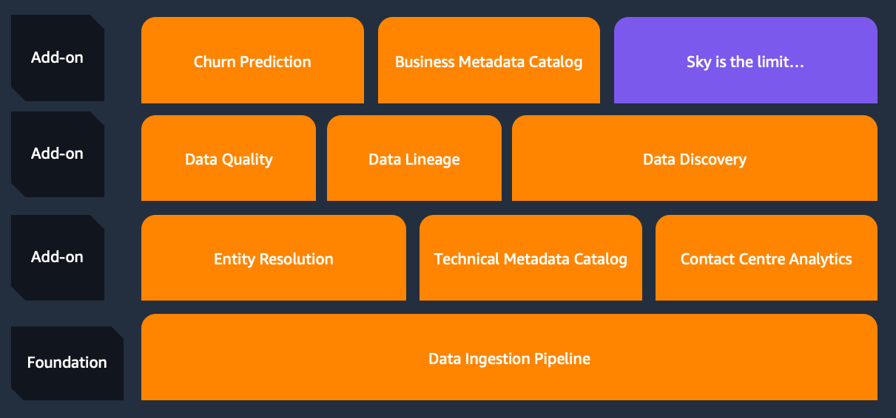
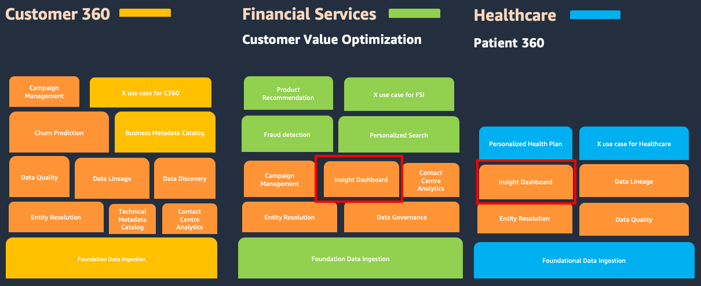

# Industry Blueprints for Data & AI Components

## Challenges of package development for industry solutions

 The challenges of package development for industry solutions encompass factors such as the potential short lifespan of solutions, the need to adapt to new AWS services and features, the effort required to update older solutions, ensuring solution effectiveness, providing an acceleration framework for partners and customers, and addressing the design and development demands of multi-vertical solutions. Overcoming these challenges requires a combination of agility, innovation, and a deep understanding of industry needs.

## Componentized building mechanism

As shown in the above diagram, our process for creating end-to- end solutions using Industry Blueprints begins with a foundational data ingestion pipeline. From there, we incorporate add-on modules that include comprehensive business logic. Each of these components is designed to be `pluggable` and generic enough to cater to the specific needs of various vertical solutions. The components of the blueprints encapsulate existing AWS Data and AI services. Our approach to building solutions is similar to putting together `LEGO` blocks, and as we like to say, the possibilities are limitless. 

## How to scale with componentized building mechanism

`Industry Blueprints for Data & AI `offer a wide range of components designed to cater to both industry-specific use cases, and Data Ingestion with proprietary industry standards.

To give you a clearer picture, we have color-coded these components in the following diagram. Orange represents cross-industry reusable components that can be utilized in various sectors. On the other hand, yellow, green, and blue components signify those with specific industry flavors, tailored to meet the unique requirements of different industries. These components can be seamlessly assembled together to create a comprehensive, runnable industry solution complete with business logic. 

## What Benefit does componentized building mechanism provide?

- Bring partners increased agility, efficiency, developer velocity, and lower maintenance effort with reusable cross-industry components

- Leverage cross-industry applicable base components with use case oriented add-ons to accommodate faster change and solution adaptability. This can simplify the sourcing, implementation and integration process.

