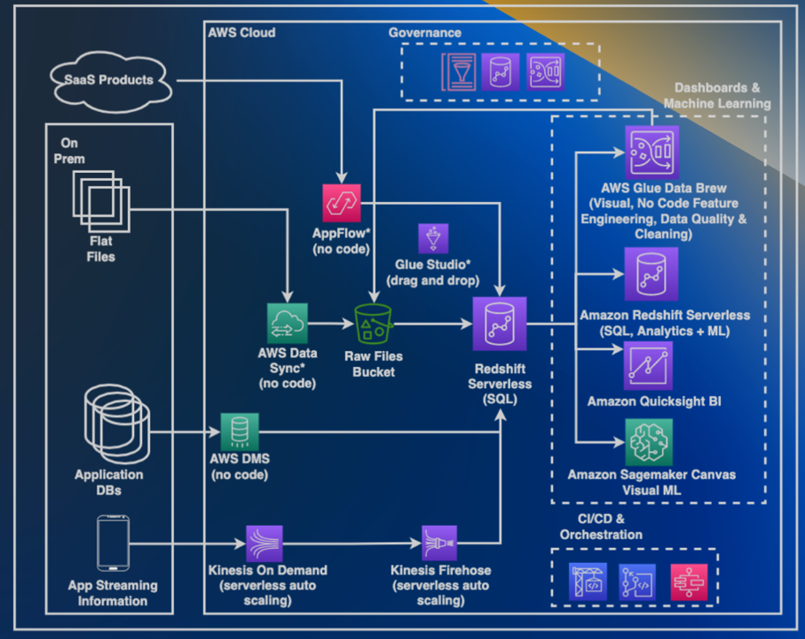

# Core Concepts

This document provides a high level overview of the Core Concepts that are embedded in the `Industry Blueprints for Data & AI` framework.

| Concept       | Description                                                           |     
|---------------|-----------------------------------------------------------------------|                             
| [Data Ingestion Pipeline](#data-ingestion-pipeline) | Collect raw data from diverse sources and channel it into the AWS Lake House architecture. |
| [Add-on Use Case](#add-on-use-case) |  Concentrate on processing and utilizing data in industry-specific ways. |
| [Blueprint](#blueprint) | A `blueprint` combines `data ingestion pipeline` and `add-on use case` modules into an end-to-end industry solution with business logic.| 

Our dedicated team ensures that the artifacts are regularly updated, reflecting the latest advancements and best practices in the data and AI landscape.

The following solution architecture diagram is an example of an end-to-end `Customer 360` solution built using `Industry Blueprints for Data & AI`.

The dashed boxes in this diagram represent `add-on use case` components that address each use case in the solution, while the remaining elements form the `data ingestion pipeline`. 

This sample end-to-end `Customer 360` solution built with Blueprints showcases several key features, including: 

- Low Code / No Code Data Ingestion: Simplifying data ingestion to make it accessible to users with varying levels of technical expertise. 
- SQL-oriented Data Pipelines: Facilitating efficient data 
processing and transformation. 
- Visual & SQL-Oriented Analytics, ML & BI in Redshift: 
Enabling powerful analytics, machine learning, and 
business intelligence capabilities. 
- Modular Architecture: Allowing for easy 
customization and adaptation of the solution to 
specific use cases. 
- Scalability & Elasticity: Ensuring that the solution can 
grow and adapt with the changing needs of the business. 

This approach simplifies the integration of common, well-architected patterns to achieve solution goals, making it easier for partners to create tailored solutions for their end customers’ specific needs. 

