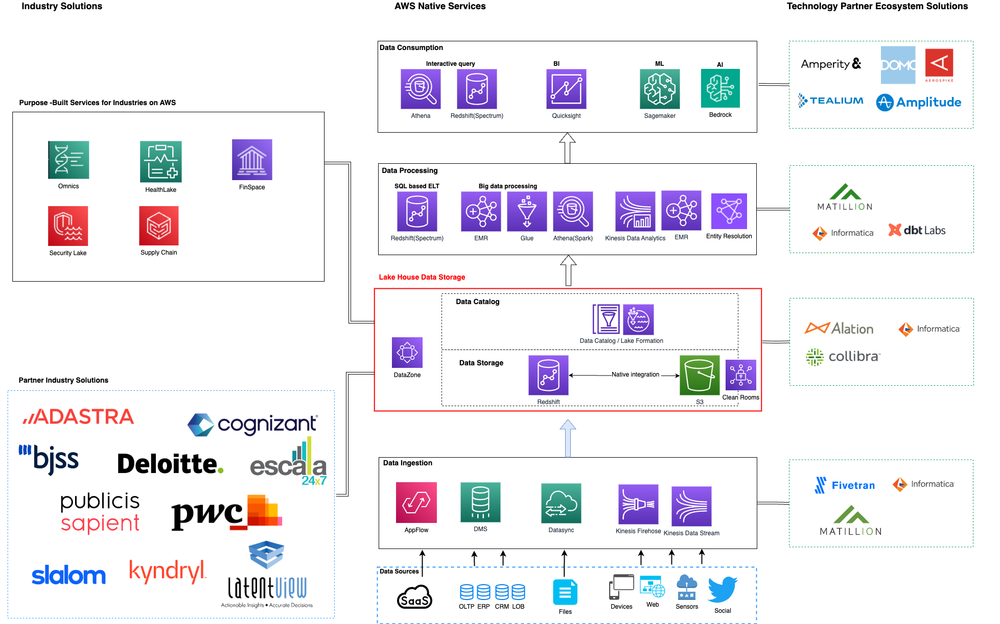

# APN Blueprints for Industry Solutions

## What is APN Blueprints?

APN Blueprints offers a suite of building components, including Terraform, CDK code, CloudFormation templates, and solution accelerators, streamlining the configuration and deployment of tailored solutions across various industry verticals. Users can swiftly provision production-ready modern compute platforms, set up foundational data ingestion components or add customized ones for specific use cases. Additionally, the Blueprints incorporate ISV products with specialized capabilities to meet specific requirements of industries by customers (E.g. Data lineage component by Collibra; Data compliance component by Alation; CDP component by Tealium). Each blueprint provides prescriptive architecture guidance with componentized runnable technical artifacts, simplifying the development of industry-specific solutions with pattern-based definitions. 

AWS Industry Blueprints for Data & AI offers a collection of building [`components`]('components.md'), including CDK code modules and solution accelerators to facilitate the configuration and deployment of tailored components for various industry verticals' data-to-insights needs. Users can swiftly set up foundational data ingestion pipeline or choose customized add-on components for specific use cases. Additionally, the Blueprints incorporate AWS technology partner ecosystem products with proprietary capabilities to meet specific requirements. This project simplifies the process of building industry solutions by providing pattern-based architectural definitions that developers can easily leverage.

The add-on components provided by Industry Blueprints for Data & AI are designed for industry-specific use cases, such as `Churn Prediction`, `Campaign Management`, and `ID Resolution`, while also addressing common tasks like `Deploying BI Dashboards` and `Data Governance`. These components can be easily combined with minimal adjustments to create comprehensive industry solutions, complete with business logic. Each component is pluggable yet generic enough to be reused for specific vertical solutions. The Blueprints components encapsulate various AWS Data & AI services, including [`Amazon AppFlow`]('https://aws.amazon.com/appflow/'), [`EMR`]('https://aws.amazon.com/emr/'), [`Kinesis`]('https://aws.amazon.com/pm/kinesis/'), [`RDS`]('https://aws.amazon.com/rds/'), [`Redshift`]('https://aws.amazon.com/redshift/'), [`DynamoDB`]('https://aws.amazon.com/dynamodb/'), [`Glue`]('https://aws.amazon.com/glue/'), [`Athena`]('https://aws.amazon.com/athena/'), as well as purpose-built services for specific industries like [`Amazon HealthLake`]('https://aws.amazon.com/healthlake/'), [`Amazon Security Lake`]('https://aws.amazon.com/security-lake/'), [`AWS Supply Chain`]('https://aws.amazon.com/aws-supply-chain/') and etc. [`AWS Solutions Constructs`]('https://docs.aws.amazon.com/solutions/latest/constructs/welcome.html') serve as building blocks for the CDK code modules, offering well-architected patterns that allow developers to define solutions in code, resulting in predictable and repeatable infrastructure.

## Why use AWS Industry Blueprints for Data & AI?

The following diagram presented illustrates the complete process of `Turn Data into Insights`, which begins at the bottom and culminates at the top. 

Regardless of the industry, the initial stage of the customers' data journey is similar. Data is gathered from multiple sources and funneled into the AWS Lake House. Subsequently, the data is processed and utilized according to specific use cases. 

As part of the Industry Blueprints for Data & AI framework, we aim to break down this data journey into two main components categories: a foundational `data ingestion pipeline` and specialized `use case modules` that are tailored to each industry's unique needs. These modules concentrate on processing and utilizing data in industry-specific ways, adding a distinct flavor to the process. As we can see from the righthand side of the diagram, the framework also encompasses technology partner ecosystem products, which may provide customers with exclusive capabilities. As depicted on the top right side, AWS industry-specific services, built with a specific purpose in mind, can act as catalysts for accelerating solution building. On the bottom left are our partners who offer industry-specific solutions built on AWS data and analytics services. 
